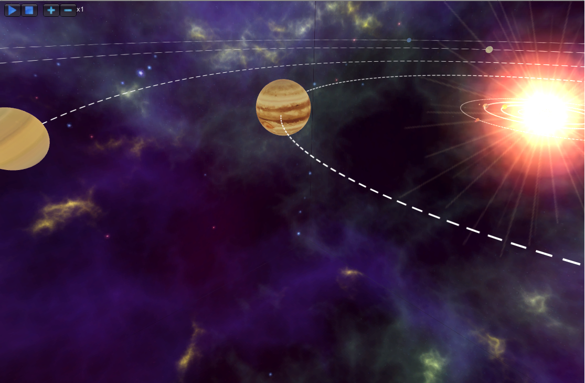

# Unity.SolarSystem

rewamp of original project by [sotos82 - SolarSystemSimulatorGame](https://github.com/sotos82/SolarSystemSimulatorGame) for learning ECS (Entity Component System) architectural pattern
